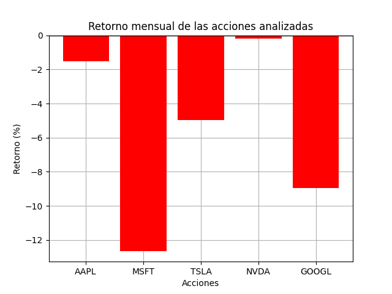

# Analizador Multiacción

Programa en Python que, a partir de un input de varias acciones, analiza su retorno mensual y genera una gráfica de barras de resultados. 

## Funcionalidades

- Análisis simultáneo de n acciones.
- Cálculo del retorno mensual.
- Cálculo del Sharpe Ratio
- Identificación de mejor y peor acción, y del mejor Sharpe Ratio.
- Gráfico de resultados con código de colores.

## Tecnologías

- Python 3.14.0
- Matplotlib, yfinance

## Instalación
```bash
pip install yfinance matplotlib
```

## Uso
```bash
python analizador_multiple.py
```

El programa pedirá 5 tickers (símbolos de acciones). Ejemplo:
- AAPL (Apple)
- MSFT (Microsoft)
- TSLA (Tesla)
- NVDA (Nvidia)
- GOOGL (Google)

## 📊 Ejemplo de salida
```

--- Resultados Mensuales ---
1. AAPL: +7.44 % | Sharpe Ratio: 3.75
2. MSFT: -11.80 % | Sharpe Ratio: -3.89
3. TSLA: -1.45 % | Sharpe Ratio: -0.60
4. NVDA: +6.13 % | Sharpe Ratio: 2.37
5. GOOGL: -5.79 % | Sharpe Ratio: -4.35
La mejor acción ha sido AAPL, con un retorno del +7.44%.
La peor acción ha sido MSFT, con un retorno del -11.80%.
Mejor Sharpe ratio: AAPL (3.75) <== Mejor relación riesgo/retorno



```

